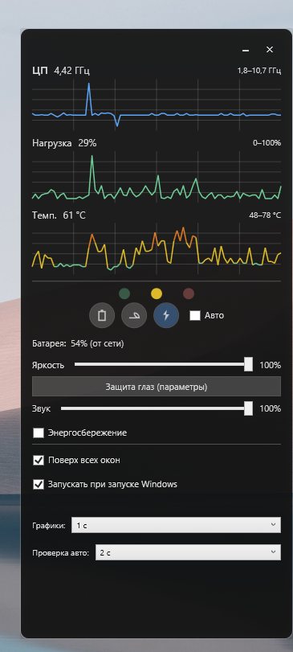

# Power Manager

Виджет для Windows: управление кастомными схемами электропитания, мониторинг CPU (частота, нагрузка, температура), яркость, громкость и энергосбережение.


## Возможности

- **Три схемы питания:** Минимум (экономия), Сбалансированная, Максимум (производительность) — создаются скриптами и переключаются из виджета.
- **Графики в реальном времени:** частота CPU, загрузка %, максимальная температура по датчикам (LibreHardwareMonitor).
- **Авто-режим:** автоматический выбор схемы по нагрузке, температуре и уровню батареи (интервалы настраиваются).
- **Яркость и громкость** — ползунки в виджете (WMI для яркости, NAudio для звука).
- **Энергосбережение** — галочка синхронизирована с системным переключателем (powercfg).
- **Защита глаз** — кнопка открывает параметры ночного режима Windows.
- **Выход** — при закрытии можно выбрать, какую схему оставить активной.

## Требования

- **Windows 10 или 11**
- **.NET 8.0 SDK** (для сборки) или готовый runtime для запуска exe
- Для доступа к температуре CPU желательно **запуск от имени администратора** (или настроенные права для LibreHardwareMonitor)

## Быстрый старт

1. **Клонировать репозиторий**
   ```powershell
   git clone https://github.com/ai-art-agent/power_manager.git
   cd power_manager
   ```

2. **Создать три схемы электропитания** (один раз, от администратора рекомендуется)
   ```powershell
   .\scripts\Install-PowerManagerSchemes.ps1
   ```
   В корне появится `scheme-guids.json` с GUID схем. Скрипт удаляет старые схемы Power Manager и лишние системные схемы.

3. **Запустить виджет**
   ```powershell
   dotnet run --project src\PowerManagerWidget\PowerManagerWidget.csproj
   ```
   Или собрать и запустить exe:
   ```powershell
   dotnet build src\PowerManagerWidget\PowerManagerWidget.csproj -c Release
   .\src\PowerManagerWidget\bin\Release\net8.0-windows\PowerManagerWidget.exe
   ```
   Рядом с exe должен лежать **scheme-guids.json** (копируется при сборке из корня).

Подробная пошаговая инструкция: **[docs/GETTING-STARTED.md](docs/GETTING-STARTED.md)**  
Описание схем и параметров powercfg: **[docs/power-schemes.md](docs/power-schemes.md)**

## Структура проекта

| Путь | Описание |
|------|----------|
| `scripts/Install-PowerManagerSchemes.ps1` | Создание трёх схем и запись GUID в `scheme-guids.json` |
| `scripts/Apply-PowerScheme.ps1` | Переключение схемы из консоли: `-Scheme Min\|Balanced\|Max` |
| `scripts/List-PowerSchemes.ps1` | Вывод текущих схем (powercfg /list) |
| `scheme-guids.json` | GUID схем Min, Balanced, Max (создаётся скриптом, нужен виджету) |
| `src/PowerManagerWidget/` | WPF-виджет (графики, кнопки схем, яркость, звук, батарея) |
| `src/PowerSchemeTest/` | Тест схем нагрузкой (опционально) |
| `src/SensorTest/` | Тест датчиков CPU/вентиляторов (опционально) |
| `docs/` | Документация и чек-лист тестирования виджета |

## Сборка

```powershell
dotnet build PowerManager.sln -c Release
```

Только виджет:

```powershell
dotnet build src\PowerManagerWidget\PowerManagerWidget.csproj -c Release
```

## Лицензия

Проект распространяется под лицензией MIT — см. файл [LICENSE](LICENSE). При публикации на GitHub укажите год и имя (или ник) в copyright.
